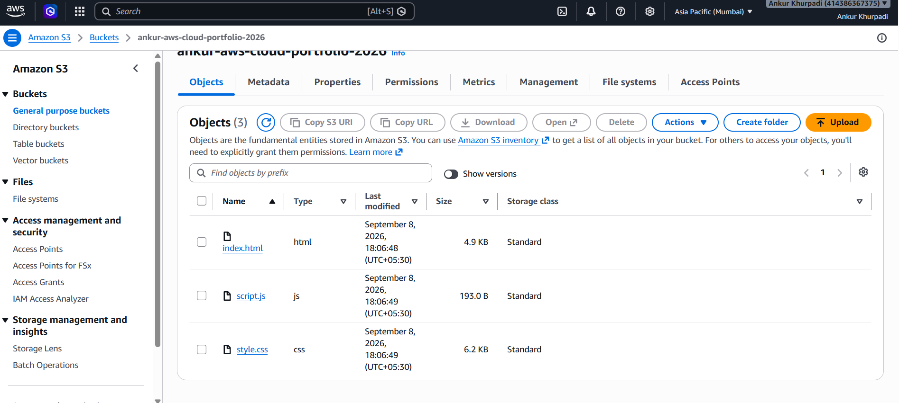
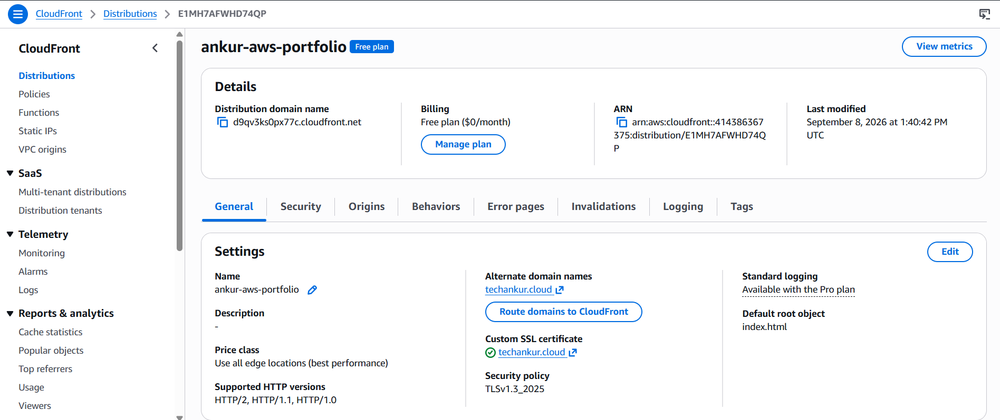
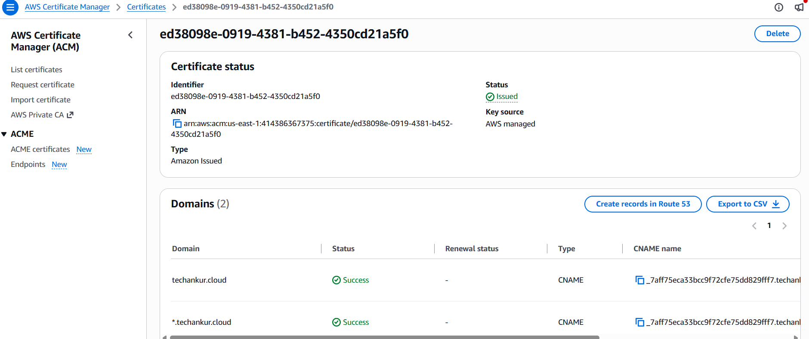
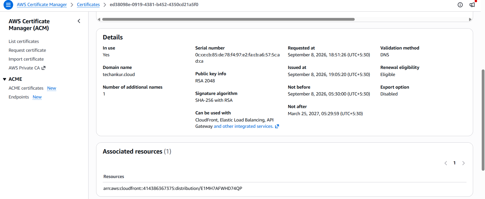
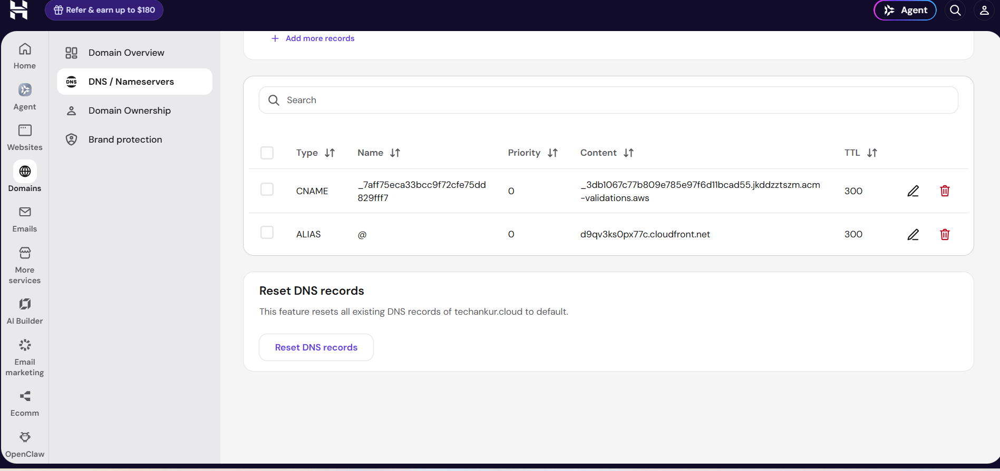
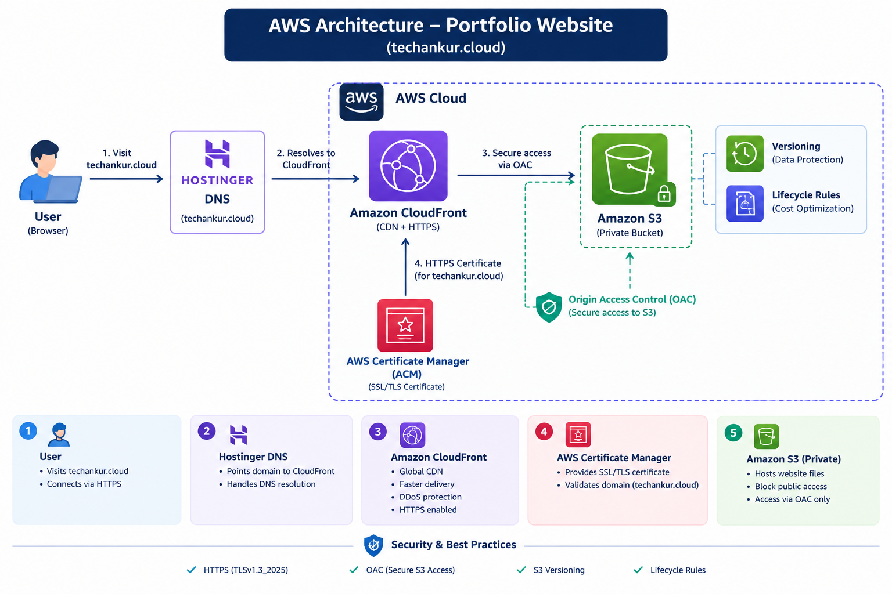

# ☁️ AWS Cloud Portfolio

A professional static portfolio website deployed on AWS using Amazon S3 and Amazon CloudFront, with HTTPS, custom domain, secure S3 access, versioning, and lifecycle management.

## 🌐 Live Website

👉 https://techankur.cloud

## 📌 Project Overview

This project demonstrates how to deploy a secure and globally accessible static website using AWS cloud services.

The website is hosted in a private Amazon S3 bucket and delivered globally through Amazon CloudFront. HTTPS is enabled using AWS Certificate Manager (ACM), while CloudFront Origin Access Control (OAC) securely connects CloudFront to the private S3 bucket.

## 🏗️ Architecture

```text
                    User
                      │
                      ▼
              Hostinger DNS
                      │
                      ▼
              Amazon CloudFront
                 HTTPS / CDN
                      │
                 OAC (Secure)
                      │
                      ▼
             Private Amazon S3
                /          \
         Versioning      Lifecycle
                      │
                      ▼
                Website Files
```

## ☁️ AWS Services Used

### Amazon S3

- Created a private S3 bucket for website files
- Uploaded HTML, CSS and JavaScript files
- Blocked public access
- Enabled bucket versioning
- Configured lifecycle management

### Amazon CloudFront

- Configured CloudFront as the CDN
- Connected CloudFront to the S3 bucket
- Enabled Origin Access Control (OAC)
- Configured `index.html` as the default root object
- Enabled HTTPS
- Added custom domain support

### AWS Certificate Manager (ACM)

Created an SSL/TLS certificate for:

- `techankur.cloud`
- `*.techankur.cloud`

Completed DNS validation and attached the issued certificate to CloudFront.

### Hostinger DNS

- Configured DNS for the custom domain
- Pointed `techankur.cloud` to the CloudFront distribution
- Added the ACM DNS validation record

## 🔐 Security Configuration

The project follows basic AWS security best practices:

- S3 Block Public Access enabled
- S3 bucket is not publicly accessible
- CloudFront Origin Access Control (OAC) is used
- S3 bucket policy allows read access from CloudFront
- HTTPS is enabled
- IAM and resource permissions follow the principle of least privilege

## 🔄 Versioning & Lifecycle Management

### S3 Versioning

S3 Bucket Versioning is enabled to preserve previous versions of website objects.

This helps recover files if an object is accidentally overwritten or deleted.

### Lifecycle Policy

A lifecycle rule is configured to permanently delete noncurrent object versions after the configured retention period.

This helps manage storage usage and reduce unnecessary storage costs.

## 🚀 Deployment Workflow

1. Developed the website using HTML, CSS and JavaScript
2. Tested the website locally using VS Code and Live Server
3. Created an Amazon S3 bucket
4. Uploaded website files to S3
5. Kept the S3 bucket private
6. Created a CloudFront distribution
7. Configured Origin Access Control (OAC)
8. Added an S3 bucket policy for CloudFront access
9. Configured `index.html` as the default root object
10. Created and validated an ACM SSL certificate
11. Added the custom domain to CloudFront
12. Configured Hostinger DNS
13. Enabled S3 Versioning
14. Configured an S3 Lifecycle Policy
15. Tested the website using HTTPS

## 🛠️ Technologies

- HTML5
- CSS3
- JavaScript
- Amazon S3
- Amazon CloudFront
- AWS Certificate Manager
- AWS IAM
- DNS
- HTTPS / SSL
- Git
- GitHub
- VS Code

## 📂 Project Structure

```text
aws-cloud-portfolio/
│
├── screenshots/
│   ├── .gitkeep
│   ├── s3-bucket.png
│   ├── cloudfront.png
│   ├── acm-issued.png
│   ├── acm-details.png
│   ├── hostinger-dns.png
│   ├── website-home.png
│   ├── website-full.png
│   └── architecture.png
│
├── index.html
├── script.js
├── style.css
└── README.md
```

## 📸 Screenshots

### 🪣 S3 Bucket



### 🌐 CloudFront Distribution



### 🔐 ACM Certificate – Issued



### 📋 ACM Certificate Details



### 🌍 Hostinger DNS



### 💻 Live Website


### 🏗️ AWS Architecture



## 🌍 Project Highlights

- Secure private S3 origin
- Global content delivery using CloudFront
- HTTPS-enabled custom domain
- Origin Access Control (OAC)
- S3 Versioning
- S3 Lifecycle Management
- DNS configuration
- Static website deployment
- Git/GitHub version control

## 🎯 Learning Outcomes

Through this project, I gained practical experience with:

- AWS cloud infrastructure
- Static website deployment
- CDN configuration
- DNS management
- SSL/TLS certificates
- S3 security and access policies
- CloudFront Origin Access Control
- Version management
- Lifecycle management
- Git and GitHub

## 👨‍💻 Author

**Ankur Khurpadi**

AWS Cloud Enthusiast | Cloud Computing | Linux | Web Technologies
